# MCP for Blender 内部流程说明

本文说明当前项目中“用户通过自然语言提问，LLM 调用 MCP，再驱动 Blender 执行操作”的完整内部流程。

> 代码范围：
>
> - MCP Server：`src/blender_mcp/server.py`
> - Blender Addon：`src/blender_mcp/bundled/addon.py`
> - Addon 安装与版本管理：`src/blender_mcp/addon_manager.py`
> - 安全模式：`src/blender_mcp/safe_mode.py`
> - 程序入口：`main.py`
>
> 本文中的流程图使用 Mermaid 语法。支持 Mermaid 的 Markdown 查看器可以直接渲染；不支持时仍可根据节点文字阅读流程。

---

## 1. 系统总体架构

系统由两段通信组成：

1. **MCP 协议通信**：LLM Client ↔ MCP Server
2. **内部 TCP/JSON 通信**：MCP Server ↔ Blender Addon

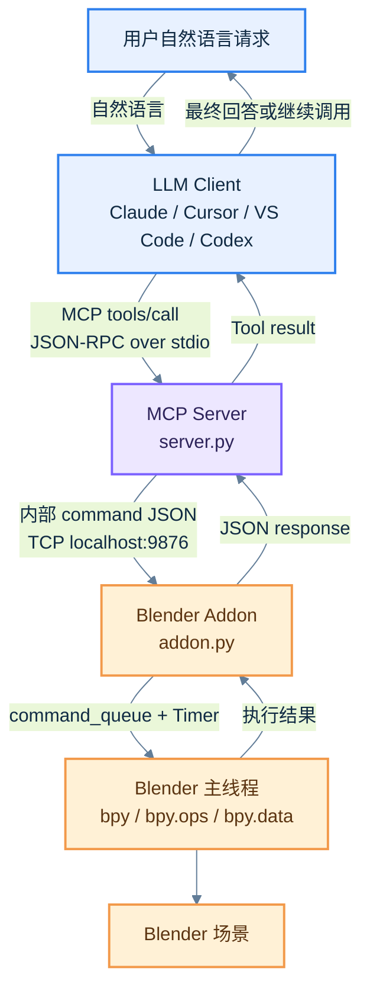

### 1.1 各模块职责

| 模块 | 文件 | 主要职责 |
|---|---|---|
| 程序入口 | `main.py` | 调用 `blender_mcp.server.main()` |
| MCP Server | `src/blender_mcp/server.py` | 注册 MCP Tools/Prompts，处理 MCP 请求，与 Blender 建立持久 TCP 连接 |
| 连接层 | `BlenderConnection` | 将 Tool 调用转成 JSON，通过 Socket 发送并读取完整响应 |
| Blender Addon Server | `BlenderMCPServer` | 在 Blender 内监听 TCP 端口，接收外部命令 |
| 命令队列 | `command_queue` | 将 Socket 线程收到的命令转交 Blender 主线程 |
| 命令分发器 | `_execute_command_internal()` | 按 `command.type` 找到对应处理函数 |
| Blender 执行器 | `execute_code()` 和各类 Handler | 调用 `bpy`、执行脚本、获取场景信息、导入资源等 |
| 安全模式 | `safe_mode.py` | 可选地对 `execute_blender_code` 做 AST allowlist 校验 |
| Addon 管理器 | `addon_manager.py` | 安装 Addon、发现安装目录、协议版本握手 |
| 遥测/轨迹 | `telemetry.py`、`trajectory.py` 等 | 记录工具调用、场景轨迹和用户反馈，受用户同意状态控制 |

---

## 2. 启动流程

MCP Server 和 Blender Addon 是两个独立进程/运行环境中的组件。通常先启动 MCP Client，再由 Client 拉起 MCP Server；Blender Addon 则需要用户在 Blender 中启用并点击连接。

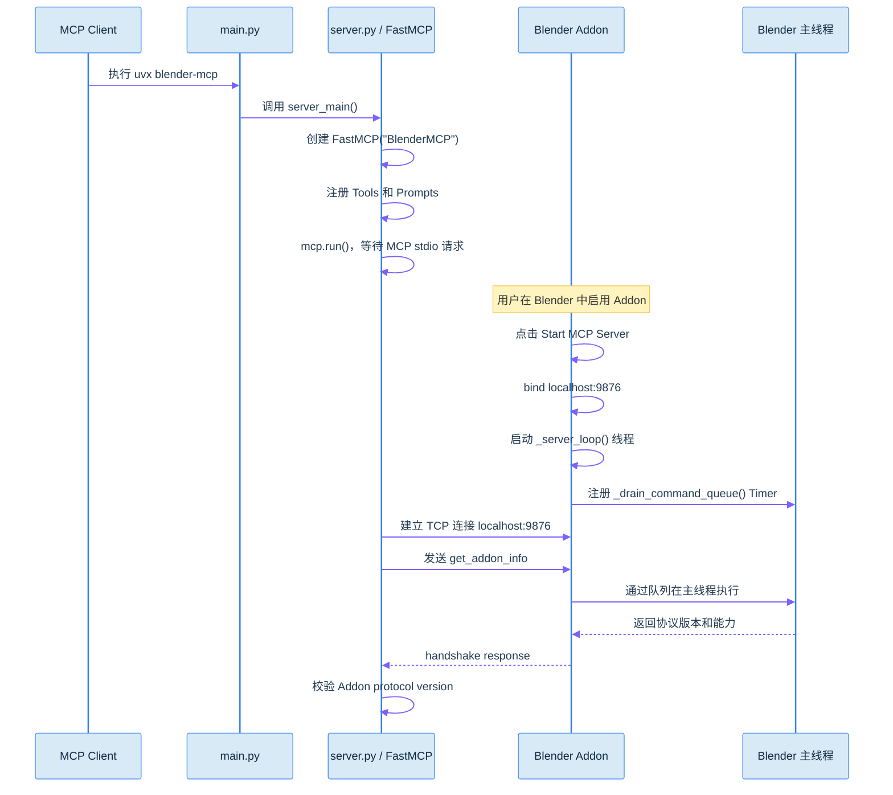

### 2.1 MCP Server 入口

`pyproject.toml` 中定义了命令入口：

```toml
[project.scripts]
blender-mcp = "blender_mcp.server:main"
```

`main.py` 只是一个包装入口：

```python
from blender_mcp.server import main as server_main


def main():
    server_main()
```

真正的启动逻辑位于 `src/blender_mcp/server.py`：

```python
mcp.run()
```

`FastMCP` 负责 MCP 协议层的初始化、工具注册、请求解析和响应封装。

### 2.2 Blender Addon 入口

Blender 中点击连接按钮后，执行：

```python
BLENDERMCP_OT_StartServer.execute()
```

该函数创建并启动：

```python
bpy.types.blendermcp_server = BlenderMCPServer(
    port=scene.blendermcp_port
)

bpy.types.blendermcp_server.start()
```

Addon 默认监听：

```text
host: localhost
port: 9876
```

Addon 不支持 `blender -b` 后台模式，因为后台模式没有正常的 Blender UI 主线程事件循环，命令队列无法按照预期执行。

---

## 3. 用户提问到 Tool 调用流程

用户的自然语言不会直接发送给 Blender。LLM 先根据 MCP Server 暴露的 Tool 名称、参数 Schema 和 docstring 判断应该调用哪个工具。

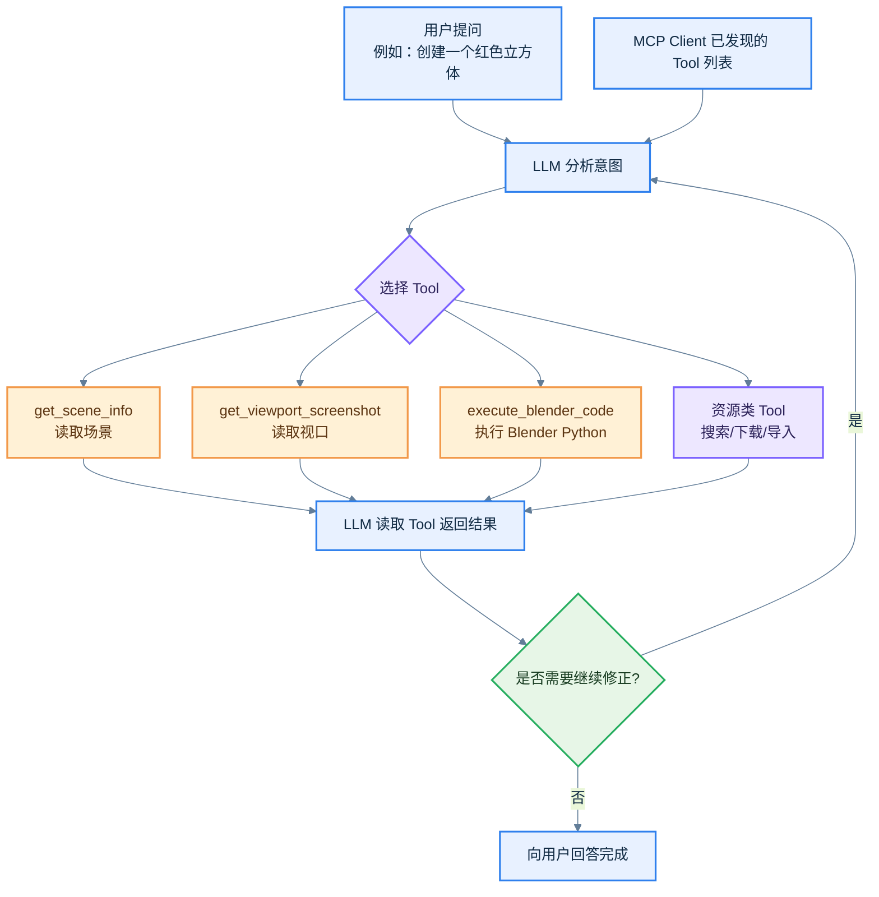

### 3.1 Tool 注册

Server 通过装饰器注册工具：

```python
@mcp.tool()
async def get_scene_info(ctx: Context, user_prompt: str = "") -> str:
    ...
```

```python
@mcp.tool()
async def execute_blender_code(
    ctx: Context,
    code: str,
    user_prompt: str = ""
) -> str:
    ...
```

LLM 可见的信息通常包括：

- Tool 名称
- 参数名称
- 参数类型
- 默认值和必填信息
- docstring 中的使用说明

`user_prompt` 用于保留用户原始意图，便于多步操作中的遥测、轨迹记录和结果关联；它不是 Blender 命令本身。

### 3.2 MCP 层的抽象调用

概念上的 MCP 请求如下：

```json
{
  "jsonrpc": "2.0",
  "id": 10,
  "method": "tools/call",
  "params": {
    "name": "get_scene_info",
    "arguments": {
      "user_prompt": "创建一个红色立方体"
    }
  }
}
```

FastMCP 将该请求路由到：

```python
get_scene_info(ctx, user_prompt="创建一个红色立方体")
```

此时仍然处于 MCP Server 进程中，还没有进入 Blender。

---

## 4. MCP Server 到 Blender Addon 的 TCP/JSON 流程

MCP Tool 函数内部通过 `get_blender_connection()` 获取持久连接，然后调用：

```python
blender.send_command(command_type, params)
```

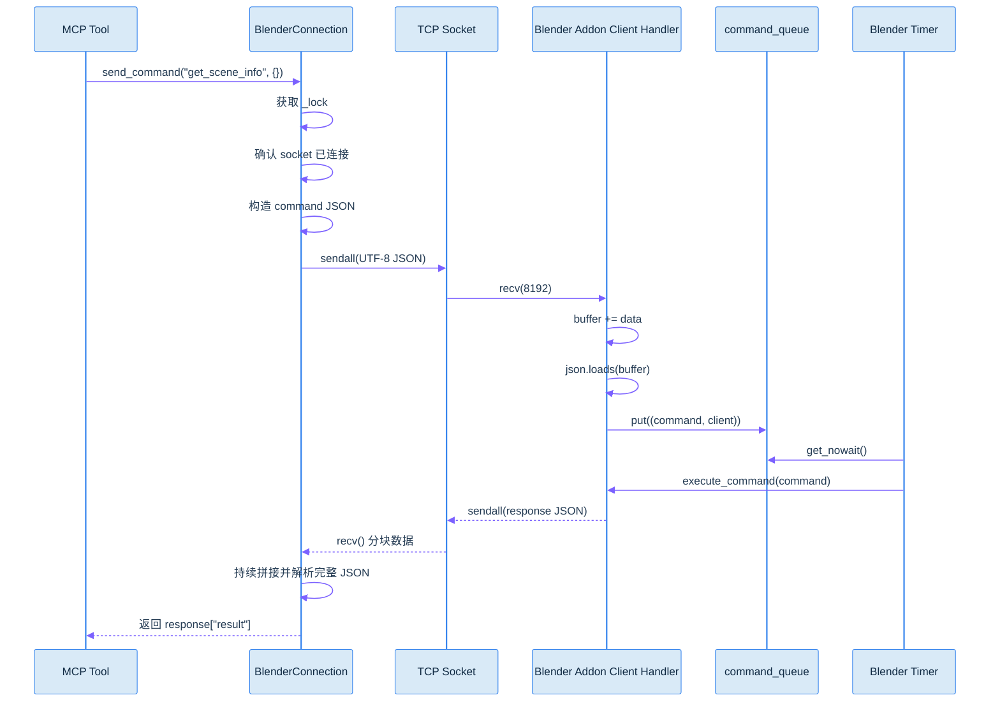

### 4.1 发送的内部命令格式

Server 统一构造：

```python
command = {
    "type": command_type,
    "params": params or {}
}
```

例如：

```json
{
  "type": "get_object_info",
  "params": {
    "name": "Cube"
  }
}
```

执行 Blender Python 时：

```json
{
  "type": "execute_code",
  "params": {
    "code": "import bpy\n..."
  }
}
```

内部 TCP 协议目前依赖请求/响应顺序，没有显式的 command ID。为防止多个请求在同一个 TCP 流中交错，`BlenderConnection.send_command()` 使用 `_lock` 将发送和接收整体串行化。

### 4.2 Server 侧连接复用

Server 使用全局变量保存连接：

```python
_blender_connection = None
```

正常情况下：

1. 第一次 Tool 调用时创建 `BlenderConnection`
2. 连接到 `localhost:9876`
3. 后续 Tool 调用复用同一个 Socket
4. 如果连接断开，下一次真实命令触发重新连接

Server 不会在每次 Tool 调用前额外发送探测命令，避免探测请求和实际请求造成响应流错位。

---

## 5. Blender Addon 的线程模型

Blender Addon 将网络 I/O 和 Blender 数据访问分离。

```mermaid
%%{init: {
  'theme': 'base',
  'flowchart': {
    'htmlLabels': true,
    'wrappingWidth': 180,
    'nodeSpacing': 36,
    'rankSpacing': 48,
    'curve': 'basis'
  },
  'themeVariables': {
    'primaryColor': '#D9EAF7',
    'primaryBorderColor': '#2F80ED',
    'primaryTextColor': '#102A43',
    'lineColor': '#627D98',
    'fontFamily': 'Segoe UI, Microsoft YaHei, sans-serif'
  }
}}%%
flowchart TB
    SS[Addon Socket Server\n_server_loop 线程]
    AC[客户端处理线程\n_handle_client]
    Q[queue.Queue\ncommand_queue]
    BT[Blender 主线程 Timer\n_drain_command_queue]
    EX[execute_command]
    BP[bpy 数据/API]
    RESP[client.sendall(response)]

    SS -->|accept()| AC
    AC -->|解析完整 JSON| Q
    Q -->|每 0.05 秒取出| BT
    BT --> EX
    EX --> BP
    BP --> EX
    EX --> RESP
    %% GitHub-compatible module colors
    classDef module_user fill:#E8F1FF,stroke:#2F80ED,stroke-width:2px,color:#102A43;
    classDef module_mcp fill:#EDE7FF,stroke:#7B61FF,stroke-width:2px,color:#2D235A;
    classDef module_transport fill:#E3F8F1,stroke:#16A085,stroke-width:2px,color:#123B32;
    classDef module_blender fill:#FFF1D6,stroke:#F2994A,stroke-width:2px,color:#5C3512;
    classDef module_external fill:#FCE8F3,stroke:#D63384,stroke-width:2px,color:#5A1738;
    classDef module_result fill:#E7F6E7,stroke:#27AE60,stroke-width:2px,color:#173B20;
    classDef module_error fill:#FFE4E4,stroke:#EB5757,stroke-width:2px,color:#5A1717;
    class SS module_transport;
    class AC module_user;
    class Q module_transport;
    class BT module_transport;
    class EX module_result;
    class BP module_blender;
    class RESP module_user;
```

### 5.1 Socket 接收线程

`_server_loop()` 负责接受客户端：

```python
client, address = self.socket.accept()
```

每个客户端连接由独立线程处理：

```python
threading.Thread(
    target=self._handle_client,
    args=(client,)
)
```

`_handle_client()` 的职责只有：

1. 接收字节流
2. 拼接到 `buffer`
3. 尝试解析 JSON
4. 将命令放入 `command_queue`

它不会直接调用 `bpy`。

### 5.2 Blender 主线程队列

Addon 启动时注册：

```python
bpy.app.timers.register(
    self._drain_command_queue,
    persistent=True
)
```

Timer 每隔约 `0.05` 秒运行：

```python
command, client = self.command_queue.get_nowait()
response = self.execute_command(command)
client.sendall(response_json.encode("utf-8"))
```

这样可以保证实际的 `bpy` 访问发生在 Blender 主线程中。

### 5.3 为什么采用队列

如果 Socket 线程直接执行：

```python
bpy.ops.mesh.primitive_cube_add(...)
```

可能发生 Blender API 的线程安全问题。当前实现使用：

```text
网络线程负责接收
主线程负责 Blender 操作
网络线程/主线程之间使用 Queue 传递命令
```

---

## 6. Blender 命令分发流程

```mermaid
%%{init: {
  'theme': 'base',
  'flowchart': {
    'htmlLabels': true,
    'wrappingWidth': 180,
    'nodeSpacing': 36,
    'rankSpacing': 48,
    'curve': 'basis'
  },
  'themeVariables': {
    'primaryColor': '#D9EAF7',
    'primaryBorderColor': '#2F80ED',
    'primaryTextColor': '#102A43',
    'lineColor': '#627D98',
    'fontFamily': 'Segoe UI, Microsoft YaHei, sans-serif'
  }
}}%%
flowchart TB
    C[command JSON]
    P[读取 command.type 和 command.params]
    Ping{type == ping?}
    H[构造 handlers 映射]
    E{集成是否启用?}
    B[基础 Handler]
    PH[Poly Haven Handler]
    SK[Sketchfab Handler]
    PP[Poly Pizza Handler]
    H3[Hyper3D Handler]
    HY[Hunyuan3D Handler]
    F[查找 handlers[cmd_type]]
    X[handler(**params)]
    OK[包装为 status=success]
    ERR[包装为 status=error]
    OUT[返回 JSON]

    C --> P
    P --> Ping
    Ping -->|是| OK
    Ping -->|否| H
    H --> E
    E --> B
    E --> PH
    E --> SK
    E --> PP
    E --> H3
    E --> HY
    B --> F
    PH --> F
    SK --> F
    PP --> F
    H3 --> F
    HY --> F
    F --> X
    X -->|成功| OK
    X -->|异常| ERR
    OK --> OUT
    ERR --> OUT
    %% GitHub-compatible module colors
    classDef module_user fill:#E8F1FF,stroke:#2F80ED,stroke-width:2px,color:#102A43;
    classDef module_mcp fill:#EDE7FF,stroke:#7B61FF,stroke-width:2px,color:#2D235A;
    classDef module_transport fill:#E3F8F1,stroke:#16A085,stroke-width:2px,color:#123B32;
    classDef module_blender fill:#FFF1D6,stroke:#F2994A,stroke-width:2px,color:#5C3512;
    classDef module_external fill:#FCE8F3,stroke:#D63384,stroke-width:2px,color:#5A1738;
    classDef module_result fill:#E7F6E7,stroke:#27AE60,stroke-width:2px,color:#173B20;
    classDef module_error fill:#FFE4E4,stroke:#EB5757,stroke-width:2px,color:#5A1717;
    class C module_transport;
    class P module_result;
    class Ping module_result;
    class H module_blender;
    class E module_result;
    class B module_blender;
    class PH module_blender;
    class SK module_blender;
    class PP module_blender;
    class H3 module_blender;
    class HY module_blender;
    class F module_blender;
    class X module_blender;
    class OK module_result;
    class ERR module_error;
    class OUT module_transport;
```

核心函数：

```python
def _execute_command_internal(self, command):
    cmd_type = command.get("type")
    params = command.get("params", {})
```

基础 Handler 示例：

```python
handlers = {
    "get_scene_info": self.get_scene_info,
    "get_world_state_snapshot": self.get_world_state_snapshot,
    "get_addon_info": self.get_addon_info,
    "get_object_info": self.get_object_info,
    "get_viewport_screenshot": self.get_viewport_screenshot,
    "execute_code": self.execute_code,
}
```

集成类 Handler 只有在对应 Blender 配置开关开启后才加入映射，例如：

```python
if bpy.context.scene.blendermcp_use_polyhaven:
    handlers.update({
        "search_polyhaven_assets": self.search_polyhaven_assets,
        "download_polyhaven_asset": self.download_polyhaven_asset,
    })
```

因此即使 MCP Server 暴露了某个资源 Tool，Blender Addon 仍可能因为集成未启用而返回未知命令或不可用状态。

---

## 7. 直接执行 Blender Python 的流程

`execute_blender_code` 是最通用的场景修改入口。

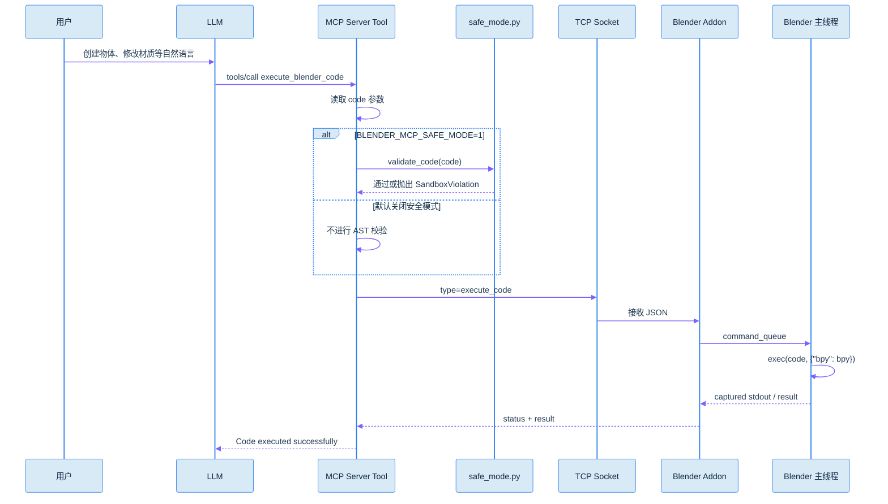

Addon 中的执行逻辑：

```python
namespace = {"bpy": bpy}

capture_buffer = io.StringIO()
with redirect_stdout(capture_buffer):
    exec(code, namespace)

return {
    "executed": True,
    "result": capture_buffer.getvalue()
}
```

### 7.1 示例

LLM 可能生成：

```python
import bpy

bpy.ops.mesh.primitive_cube_add(location=(0, 0, 0))
obj = bpy.context.object
obj.name = "RedCube"

mat = bpy.data.materials.new("RedMaterial")
mat.diffuse_color = (1.0, 0.0, 0.0, 1.0)
obj.data.materials.append(mat)
```

执行路径：

```text
LLM 生成 Python
→ execute_blender_code()
→ send_command("execute_code", {"code": code})
→ Blender command_queue
→ Blender 主线程
→ exec(code, namespace)
→ bpy 修改场景
```

### 7.2 安全模式

安全模式通过环境变量启用：

```text
BLENDER_MCP_SAFE_MODE=1
```

`safe_mode.py` 使用 AST 检查代码，默认 deny-by-default，仅允许指定模块、内置函数和操作结构。

重点阻止的能力包括：

- `eval`、`exec`、`compile`、`__import__`
- `open`
- `os`、`sys`、`subprocess`、`socket` 等进程/文件/网络模块
- `__class__`、`__subclasses__`、`__globals__` 等解释器逃逸路径
- Blender 持久化 Handler、Timer、Driver
- Addon 安装、Console 执行等代码执行入口

安全模式的边界：

> 它只保护经过 MCP Server 的 `execute_blender_code` 路径；Blender Addon 的本地 TCP 端口仍然可以被其他本机进程直接连接。

---

## 8. 场景观察流程

LLM 通常采用“先观察、再操作、后验证”的方式。

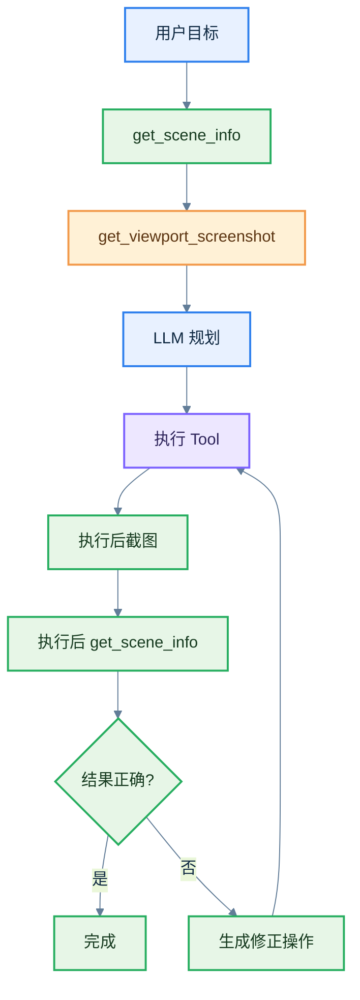

### 8.1 `get_scene_info`

MCP Server：

```python
result = blender.send_command("get_scene_info")
```

Addon：

```python
self.get_scene_info()
```

返回内容包括：

- 当前场景名称
- 对象数量
- 前若干个对象的名称
- 对象类型
- 对象位置
- 材质数量

### 8.2 `get_object_info`

发送：

```json
{
  "type": "get_object_info",
  "params": {
    "name": "Cube"
  }
}
```

Addon 分发为：

```python
self.get_object_info(name="Cube")
```

### 8.3 `get_viewport_screenshot`

截图流程与普通 JSON 结果不同：

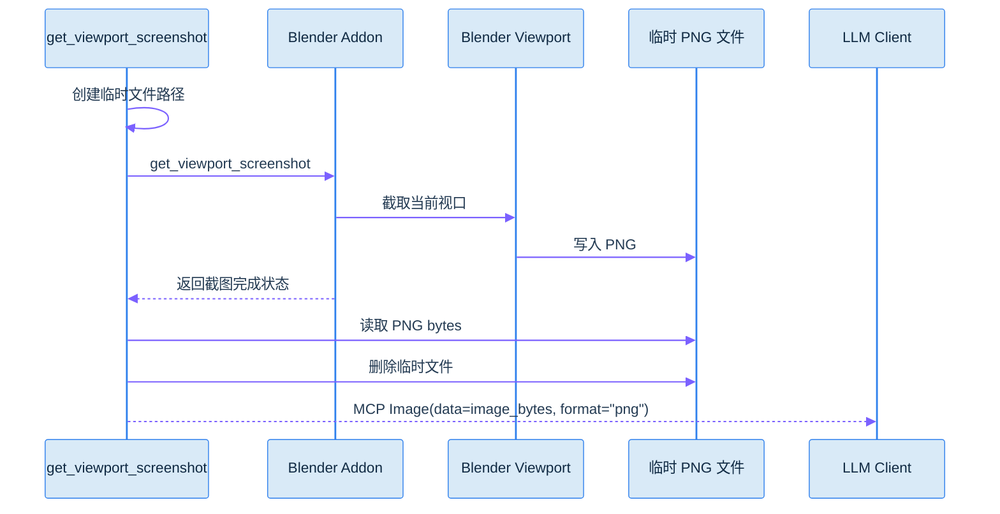

截图不是通过 JSON Base64 直接作为普通文本返回，而是在 MCP Server 侧读取 PNG 后包装为 `Image` 返回。

---

## 9. 资源搜索、下载和导入流程

### 9.1 Poly Haven / Sketchfab / Poly Pizza

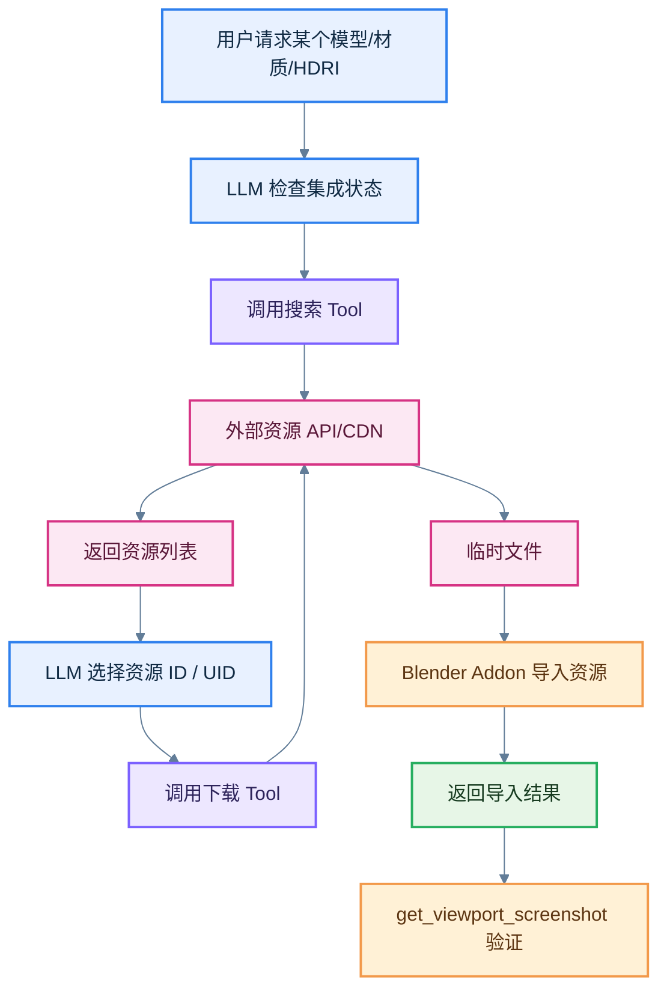

典型调用顺序：

```text
get_polyhaven_status()
→ search_polyhaven_assets(...)
→ download_polyhaven_asset(...)
→ get_viewport_screenshot()
→ get_scene_info()
```

对于 Sketchfab：

```text
get_sketchfab_status()
→ search_sketchfab_models(...)
→ download_sketchfab_model(...)
```

对于 Poly Pizza：

```text
get_polypizza_status()
→ search_polypizza_models(...)
→ download_polypizza_model(...)
```

资源集成是否可用，受 Blender 场景中的开关控制，例如：

```python
bpy.context.scene.blendermcp_use_polyhaven
bpy.context.scene.blendermcp_use_sketchfab
bpy.context.scene.blendermcp_use_polypizza
```

### 9.2 AI 生成模型

Hyper3D Rodin 和 Hunyuan3D 一般采用异步任务流程：

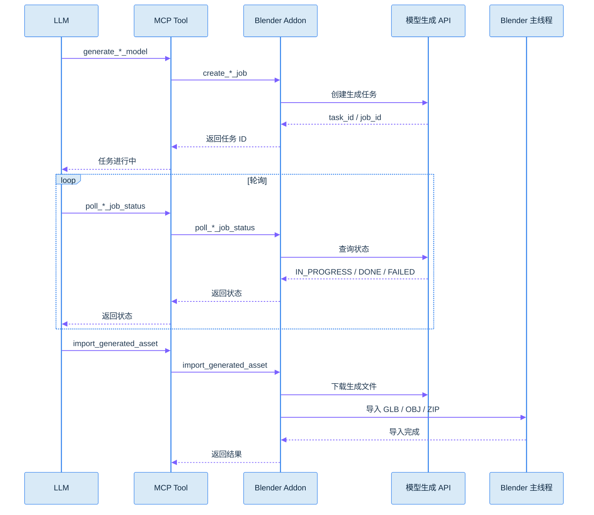

策略 Prompt `asset_creation_strategy()` 建议：

1. 先检查当前场景
2. 检查各个资源集成是否启用
3. 优先搜索已有资源
4. 没有合适资源时再使用模型生成
5. 生成任务完成后导入模型
6. 导入后检查模型的 `world_bounding_box`
7. 最后截图和读取场景进行验证

---

## 10. 响应返回流程

Blender Addon 统一返回如下结构：

```json
{
  "status": "success",
  "result": {}
}
```

失败时：

```json
{
  "status": "error",
  "message": "错误信息"
}
```

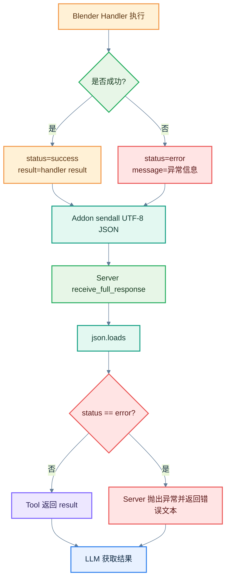

Server 的 `receive_full_response()` 会反复执行 `recv()`，将多个 TCP 分片拼接起来，直到：

```python
json.loads(data.decode("utf-8"))
```

能够成功解析完整 JSON。

TCP 本身没有消息边界，因此不能假设一次 `recv()` 就能得到完整响应。

---

## 11. 错误处理与重连流程

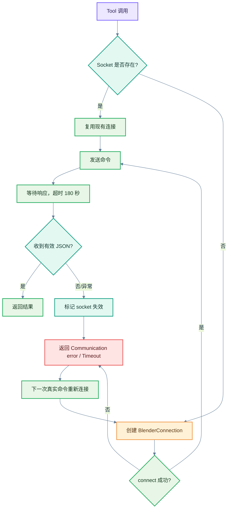

主要异常包括：

- Blender Addon 没有启动
- 端口 `9876` 被占用
- Blender 用户关闭了 Addon Server
- Blender 执行命令超过 `180` 秒
- Socket 被重置
- 返回数据不是完整 JSON
- Handler 内部抛出异常

当前 Server 会在通信错误后将连接置为失效：

```python
self.sock = None
```

之后由下一次真实命令触发重新连接。

---

## 12. Addon 版本握手和安装流程

### 12.1 Addon 安装流程

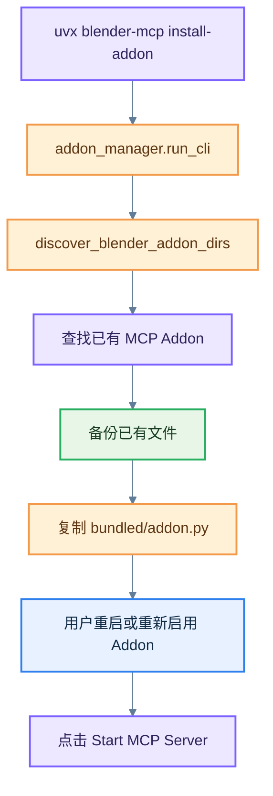

Addon 的打包副本位于：

```text
src/blender_mcp/bundled/addon.py
```

安装工具会将它复制到 Blender 的用户 Addon 目录，默认安装文件名为：

```text
blender_mcp.py
```

### 12.2 版本握手流程

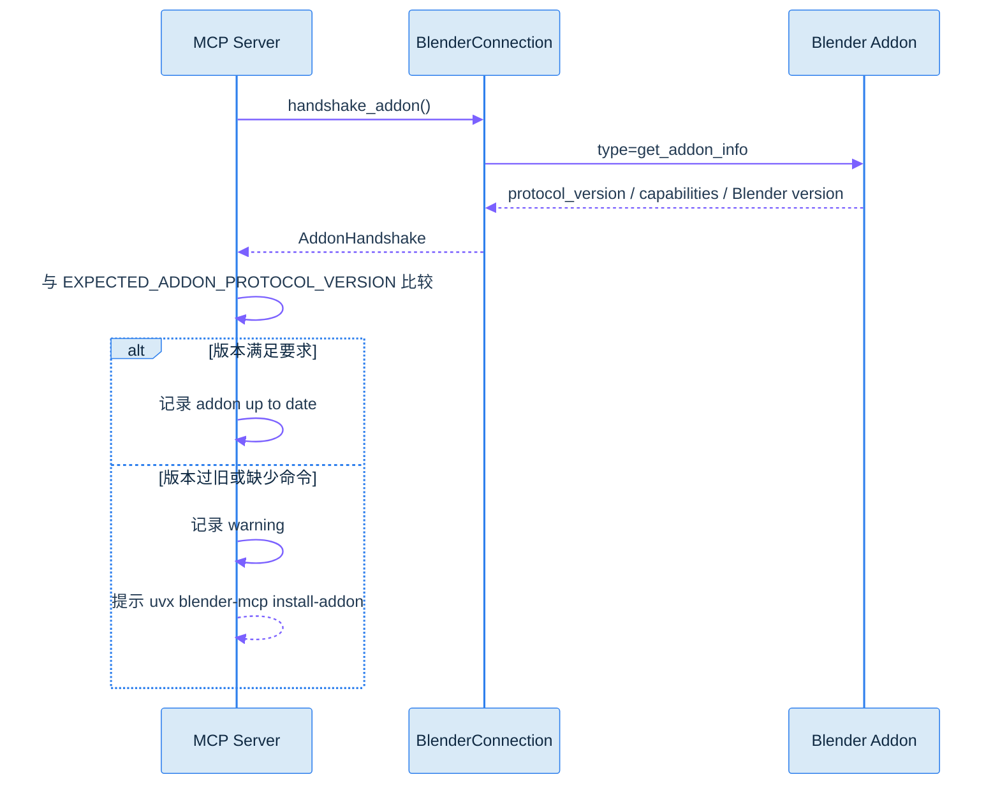

当前 Server 期望的协议版本来自：

```python
EXPECTED_ADDON_PROTOCOL_VERSION = 5
```

Addon 侧也定义：

```python
ADDON_PROTOCOL_VERSION = 5
```

握手数据包括：

- Addon 名称
- Addon 版本
- 协议版本
- 支持的 capabilities
- Blender 版本

---

## 13. Telemetry 和 Trajectory 模块

部分 Tool 使用装饰器：

```python
@telemetry_tool("get_scene_info")
```

或者：

```python
@trajectory_tool("execute_blender_code", capture_code=True)
```

这些装饰器在 Tool 执行前后记录工具名、成功状态、耗时和必要的轨迹信息。

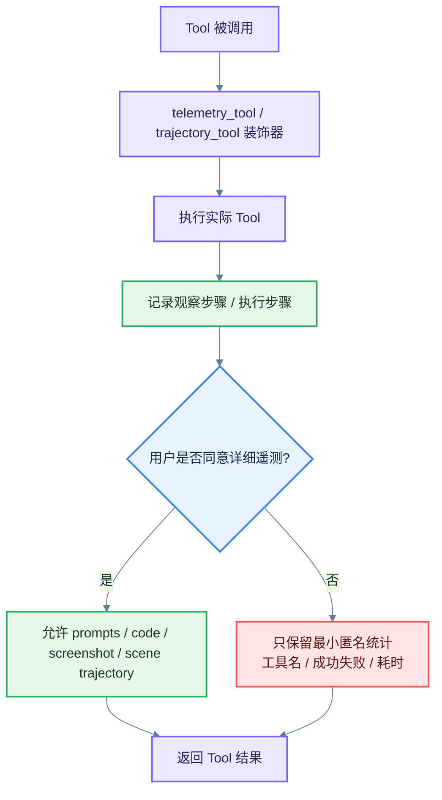

Blender Addon 还提供：

```text
get_telemetry_consent
set_telemetry_consent
```

Server 提供：

```text
disable_telemetry
```

默认设计中，即使用户没有同意详细数据收集，也可能保留最小匿名的工具使用统计；具体内容由项目的 Telemetry 实现和用户设置决定。

---

## 14. 一次完整请求示例

用户输入：

```text
创建一个红色立方体，放在原点，并确认它出现在视口中。
```

可能的实际调用序列：

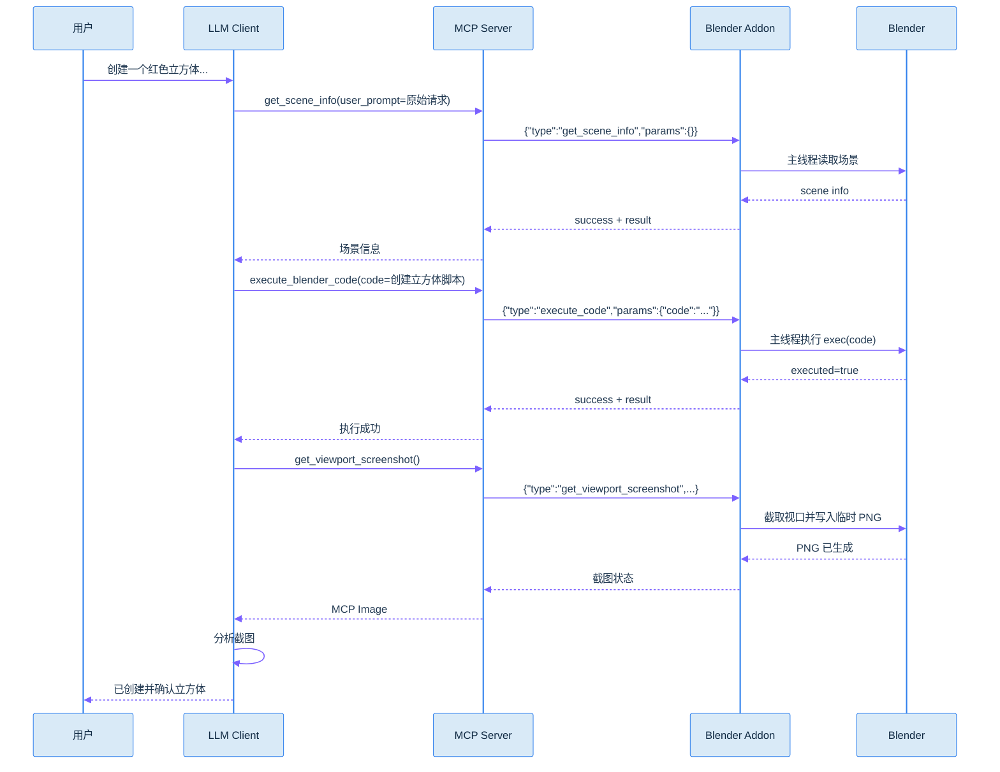

如果截图发现物体不可见，LLM 可以再次调用 `execute_blender_code` 调整相机、对象位置或视口状态。

---

## 15. 核心时序总结

```mermaid
%%{init: {
  'theme': 'base',
  'flowchart': {
    'htmlLabels': true,
    'wrappingWidth': 180,
    'nodeSpacing': 36,
    'rankSpacing': 48,
    'curve': 'basis'
  },
  'themeVariables': {
    'primaryColor': '#D9EAF7',
    'primaryBorderColor': '#2F80ED',
    'primaryTextColor': '#102A43',
    'lineColor': '#627D98',
    'fontFamily': 'Segoe UI, Microsoft YaHei, sans-serif'
  }
}}%%
flowchart TB
    A[用户自然语言]
    B[LLM 选择 MCP Tool]
    C[MCP Client 发送 tools/call]
    D[FastMCP 路由到 server.py 函数]
    E[Tool 调用 BlenderConnection.send_command]
    F[构造 type + params JSON]
    G[TCP localhost:9876]
    H[Addon _handle_client 接收]
    I[command_queue.put]
    J[Blender Timer 取出命令]
    K[_execute_command_internal 分发]
    L[具体 Handler / execute_code]
    M[Blender bpy 主线程操作]
    N[Addon 封装 success/error JSON]
    O[Server 接收并解析完整 JSON]
    P[MCP Tool 返回结果]
    Q[LLM 判断是否继续调用]

    A --> B --> C --> D --> E --> F --> G --> H --> I --> J --> K --> L --> M --> N --> O --> P --> Q
    Q -->|继续观察/修正| B
    Q -->|完成| R[最终回答用户]
    %% GitHub-compatible module colors
    classDef module_user fill:#E8F1FF,stroke:#2F80ED,stroke-width:2px,color:#102A43;
    classDef module_mcp fill:#EDE7FF,stroke:#7B61FF,stroke-width:2px,color:#2D235A;
    classDef module_transport fill:#E3F8F1,stroke:#16A085,stroke-width:2px,color:#123B32;
    classDef module_blender fill:#FFF1D6,stroke:#F2994A,stroke-width:2px,color:#5C3512;
    classDef module_external fill:#FCE8F3,stroke:#D63384,stroke-width:2px,color:#5A1738;
    classDef module_result fill:#E7F6E7,stroke:#27AE60,stroke-width:2px,color:#173B20;
    classDef module_error fill:#FFE4E4,stroke:#EB5757,stroke-width:2px,color:#5A1717;
    class A module_user;
    class B module_user;
    class C module_user;
    class D module_mcp;
    class E module_mcp;
    class F module_transport;
    class G module_transport;
    class H module_user;
    class I module_transport;
    class J module_transport;
    class K module_result;
    class L module_blender;
    class M module_blender;
    class N module_transport;
    class O module_transport;
    class P module_mcp;
    class Q module_user;
    class R module_user;
```

最核心的三层协议关系是：

```text
MCP 协议：LLM Client ↔ MCP Server
TCP + JSON：MCP Server ↔ Blender Addon
Blender Python API：Addon ↔ Blender 场景
```

最核心的线程关系是：

```text
Socket 接收线程 → command_queue → Blender 主线程 Timer → bpy
```

最核心的智能关系是：

```text
LLM 负责理解用户意图、选择 Tool、生成代码、读取结果和继续修正
MCP Server 负责协议适配、参数转译和连接管理
Blender Addon 负责执行固定命令、访问 bpy 和返回结果
```
